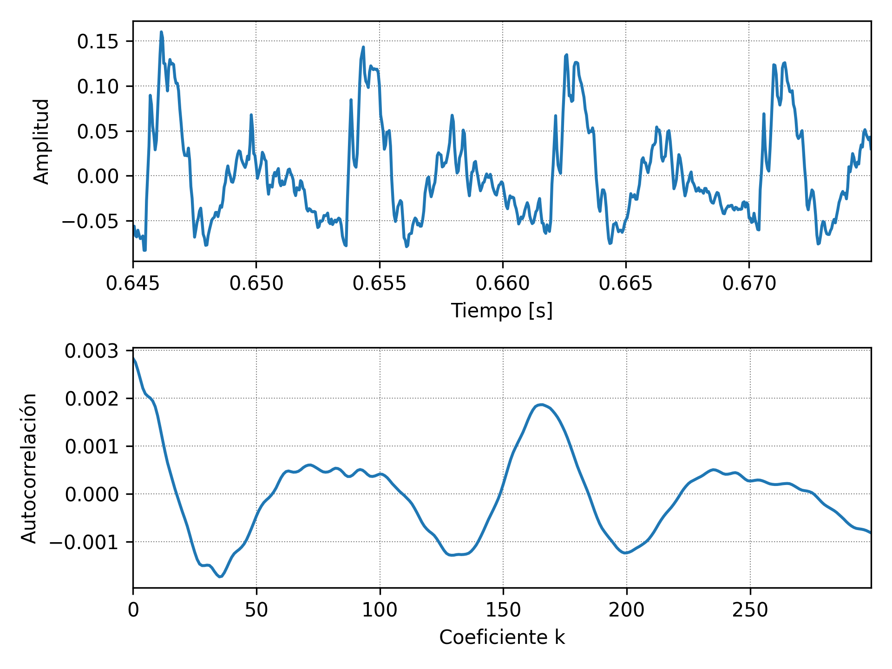

PAV - P3: estimación de pitch
=============================

Esta práctica se distribuye a través del repositorio GitHub [Práctica 3](https://github.com/albino-pav/P3).
Siga las instrucciones de la [Práctica 2](https://github.com/albino-pav/P2) para realizar un `fork` de la
misma y distribuir copias locales (*clones*) del mismo a los distintos integrantes del grupo de prácticas.

Recuerde realizar el *pull request* al repositorio original una vez completada la práctica.

Ejercicios básicos
------------------

- Complete el código de los ficheros necesarios para realizar la estimación de pitch usando el programa
  `get_pitch`.

   * Complete el cálculo de la autocorrelación e inserte a continuación el código correspondiente.
   ```c++
    // Solo calcular el rango de autocorrelacion que se vaya a usar
    for (unsigned int l = npitch_min; l < npitch_max; ++l) {
        r[l] = 0.0f;

        for (unsigned int n = l; n < x.size(); n++) {
            r[l] += x[n]*x[n-l];
        }

        r[l] /= x.size();
    }

    // Como solo se calcula un rango de valores para la autocorrelación, podria
    // ser que r[0] y r[1] no se calcularan. Por esta razón estos valores se
    // calculan a parte.
    if (npitch_min > 0) {
      for (unsigned int l = 0; l <= 1; l++) {
        r[l] = 0.0f;
        for (unsigned int n = l; n < x.size(); n++) {
          r[l] += x[n]*x[n-l];
        }

        r[l] /= x.size();
      }
    }

    if (r[0] == 0.0F) //to avoid log() and divide zero 
        r[0] = 1e-10;
   ```

   * Inserte una gŕafica donde, en un *subplot*, se vea con claridad la señal temporal de un segmento de
     unos 30 ms de un fonema sonoro y su periodo de pitch; y, en otro *subplot*, se vea con claridad la
	 autocorrelación de la señal y la posición del primer máximo secundario.

	 NOTA: es más que probable que tenga que usar Python, Octave/MATLAB u otro programa semejante para
	 hacerlo. Se valorará la utilización de la biblioteca matplotlib de Python.

     
     **NOTA**: Gráficas hechas con el siguiente script [plotter.py](plotter.py).
     Este script es una modificación de otro usado en la práctica 1 que era mas
     generico.

   * Determine el mejor candidato para el periodo de pitch localizando el primer máximo secundario de la
     autocorrelación. Inserte a continuación el código correspondiente.

   * Implemente la regla de decisión sonoro o sordo e inserte el código correspondiente.

      ```c++
      bool PitchAnalyzer::unvoiced(float pot, float r1norm, float rmaxnorm, float zcr) const {
    
        return pot < p_umaxpot || r1norm < n_umaxr1 || rmaxnorm < m_umaxnorm;
      }
      ```

- Una vez completados los puntos anteriores, dispondrá de una primera versión del estimador de pitch. El 
  resto del trabajo consiste, básicamente, en obtener las mejores prestaciones posibles con él.

  * Utilice el programa `wavesurfer` para analizar las condiciones apropiadas para determinar si un
    segmento es sonoro o sordo. 
	
	  - Inserte una gráfica con la estimación de pitch incorporada a `wavesurfer` y, junto a ella, los 
	    principales candidatos para determinar la sonoridad de la voz: el nivel de potencia de la señal
		(r[0]), la autocorrelación normalizada de uno (r1norm = r[1] / r[0]) y el valor de la
		autocorrelación en su máximo secundario (rmaxnorm = r[lag] / r[0]).

		Puede considerar, también, la conveniencia de usar la tasa de cruces por cero.

	    Recuerde configurar los paneles de datos para que el desplazamiento de ventana sea el adecuado, que
		en esta práctica es de 15 ms.

      - Use el estimador de pitch implementado en el programa `wavesurfer` en una señal de prueba y compare
	    su resultado con el obtenido por la mejor versión de su propio sistema.  Inserte una gráfica
		ilustrativa del resultado de ambos estimadores.
     
		Aunque puede usar el propio Wavesurfer para obtener la representación, se valorará
	 	el uso de alternativas de mayor calidad (particularmente Python).
  
  * Optimice los parámetros de su sistema de estimación de pitch e inserte una tabla con las tasas de error
    y el *score* TOTAL proporcionados por `pitch_evaluate` en la evaluación de la base de datos 
	`pitch_db/train`..

Ejercicios de ampliación
------------------------

- Usando la librería `docopt_cpp`, modifique el fichero `get_pitch.cpp` para incorporar los parámetros del
  estimador a los argumentos de la línea de comandos.
  
  Esta técnica le resultará especialmente útil para optimizar los parámetros del estimador. Recuerde que
  una parte importante de la evaluación recaerá en el resultado obtenido en la estimación de pitch en la
  base de datos.

  * Inserte un *pantallazo* en el que se vea el mensaje de ayuda del programa y un ejemplo de utilización
    con los argumentos añadidos.

- Implemente las técnicas que considere oportunas para optimizar las prestaciones del sistema de estimación
  de pitch.

  Entre las posibles mejoras, puede escoger una o más de las siguientes:

  * Técnicas de preprocesado: filtrado paso bajo, diezmado, *center clipping*, etc.

    En este caso hemos optado por implementar el center clipping de la siguiente forma:
    ```c++
    float Xth = 0, max = 0;

    vector<float>::iterator iX;

    for(iX= x.begin(); iX < x.end(); iX++){
        if(abs(*iX) > max){
            max = *iX;
        }
    }

    Xth = cc_height * max;

    for(iX= x.begin(); iX < x.end(); iX++){
        if(*iX > Xth) {
            *iX = *iX - Xth;
        } else {
            if(*iX < -1*Xth) {
                *iX = *iX + Xth;
            } else {
                *iX = 0;
            }
        }
    }
    ```

  * Técnicas de postprocesado: filtro de mediana, *dynamic time warping*, etc.

    Hemos decidido implementar in filtro de mediana:
    ```c++
    const int after = (median_length - 1) / 2;
    const int before = (median_length - 1) / 2;

    vector<float> result(f0);
    vector<float> tmp(median_length);
    vector<float>::iterator it_res;

    int i = before - 1;
    for (it_res = result.begin() + before - 1; it_res < result.end() - after; it_res++) {
        copy(it_res - before, it_res + after + 1, tmp.begin());
        sort(tmp.begin(), tmp.end());

        f0[i] = tmp[(median_length - 1) / 2];

        i++;
    }
    ```

  * Métodos alternativos a la autocorrelación: procesado cepstral, *average magnitude difference function*
    (AMDF), etc.

    *No implementado*

  * Optimización **demostrable** de los parámetros que gobiernan el estimador, en concreto, de los que
    gobiernan la decisión sonoro/sordo.
  * Cualquier otra técnica que se le pueda ocurrir o encuentre en la literatura.

  Encontrará más información acerca de estas técnicas en las [Transparencias del Curso](https://atenea.upc.edu/pluginfile.php/2908770/mod_resource/content/3/2b_PS%20Techniques.pdf)
  y en [Spoken Language Processing](https://discovery.upc.edu/iii/encore/record/C__Rb1233593?lang=cat).
  También encontrará más información en los anexos del enunciado de esta práctica.

  Incluya, a continuación, una explicación de las técnicas incorporadas al estimador. Se valorará la
  inclusión de gráficas, tablas, código o cualquier otra cosa que ayude a comprender el trabajo realizado.

  También se valorará la realización de un estudio de los parámetros involucrados. Por ejemplo, si se opta
  por implementar el filtro de mediana, se valorará el análisis de los resultados obtenidos en función de
  la longitud del filtro.
   

Evaluación *ciega* del estimador
-------------------------------

Antes de realizar el *pull request* debe asegurarse de que su repositorio contiene los ficheros necesarios
para compilar los programas correctamente ejecutando `make release`.

Con los ejecutables construidos de esta manera, los profesores de la asignatura procederán a evaluar el
estimador con la parte de test de la base de datos (desconocida para los alumnos). Una parte importante de
la nota de la práctica recaerá en el resultado de esta evaluación.
